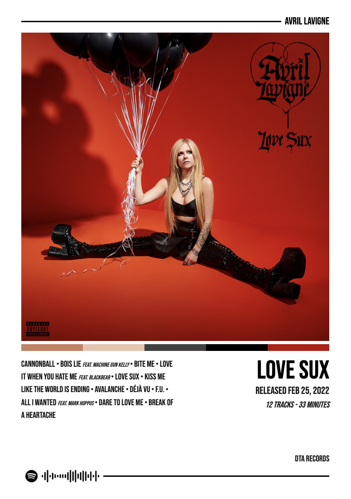
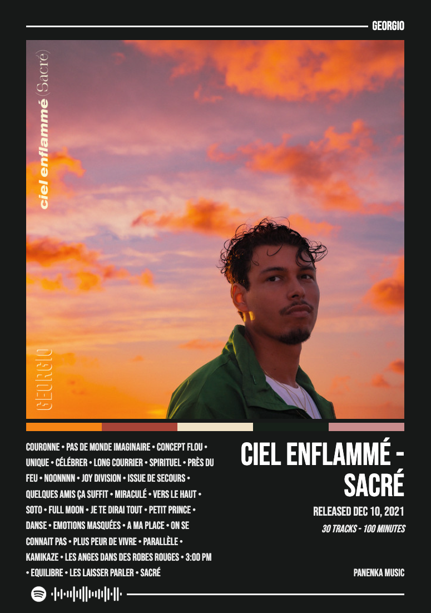

# Coverize

Generate a poster for your favorite album!

Enter a (valid) Spotify album URL, then download a poster!

## Examples

<p float="center">
  
  
</p>

---

## Features

- Spotify authentication
- Poster generation
- Poster theme mode customization (dark, light, custom)

### Ideas

- More languages (français, baguette)
- More format (A1, A2, etc...)
- More templates
- Better album search
- Custom color background
- Mobile support

### Known issues

---

## Running locally

1. Clone the repository
2. Install dependencies by running:

  ```shell
    bun install
  ```
   
3. Run the app by running:

  ```shell
    bun start
  ```

And voila!
